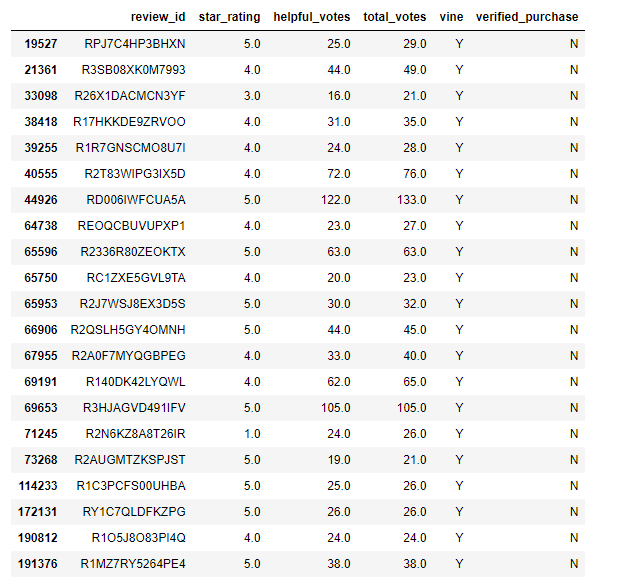
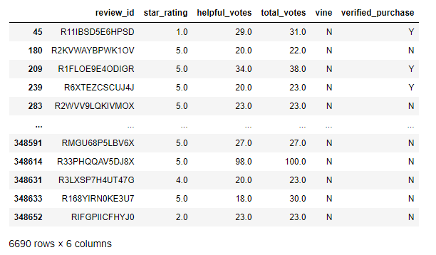
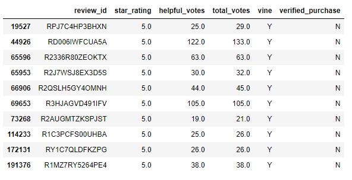
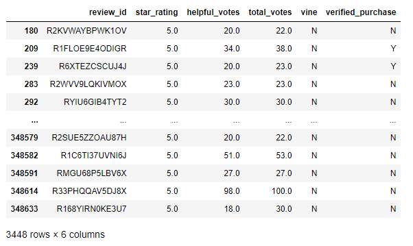

# Amazon_Vine_Analysis

## Project Overview

This project is analyzing Amazon reviews written by members of the paid Amazon Vine program.
The dataset used for this analysis is :
https://s3.amazonaws.com/amazon-reviews-pds/tsv/amazon_reviews_us_Luggage_v1_00.tsv.gz

## Results

- How many Vine reviews and non-Vine reviews were there?

    Vine reviews : 21
    
    non-Vine reviews : 6690    

**Data Frame for Vine reviews**

**Data Frame for non-Vine reviews**

- How many Vine reviews were 5 stars? How many non-Vine reviews were 5 stars?

    Vine reviews 5 stars: 10
    
    Non-vine revreviews 5 star : 3448
    
 **Data Frame for 5 star Vine reviews** 
 
 
 
 
**Data Frame for 5 star non-Vine reviews**  

 
 
- What percentage of Vine reviews were 5 stars? What percentage of non-Vine reviews were 5 stars?

    The percentage 5-star reviews for all Vine : 47.62%
    
    The percentage 5-star reviews for all non-Vine : 51.54%
    
## Summary

According to our analysis for this dataset, the percentage of 5 star vine reviews that have got 50% or more helpful votes are in line with non vine (unpaid) reviews and even lower by around 4% which shows they are not biased.  

An additional anlaysis could be chacking for 1 star rating as well to see the difference in percentages. I actually ran this and it showed the percentage for vine is 4.7% versus for un-vine is 15.92%. That means we may have a bias in giving 1 star for vine ratings. However we don't have a large data on vine ratings on this dataset and we need more data to claim the bias. 

